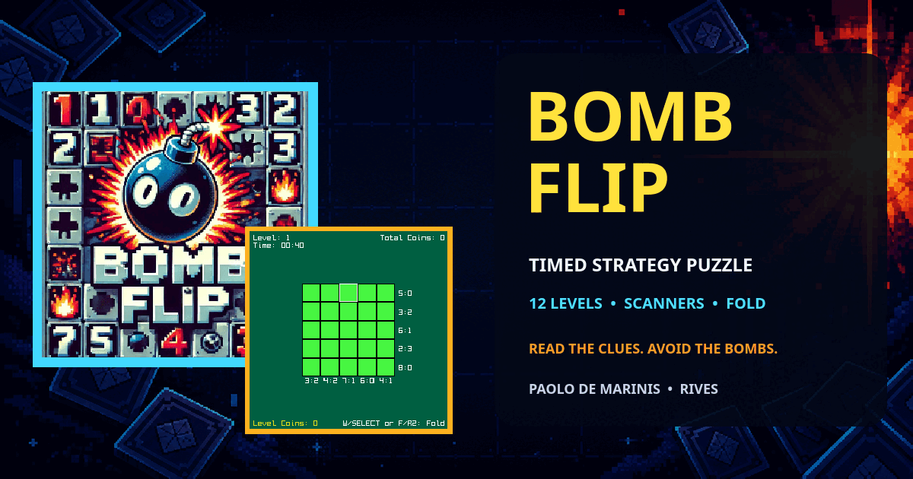
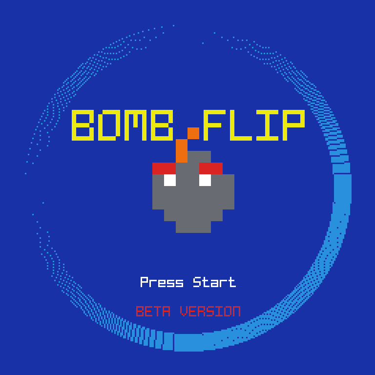
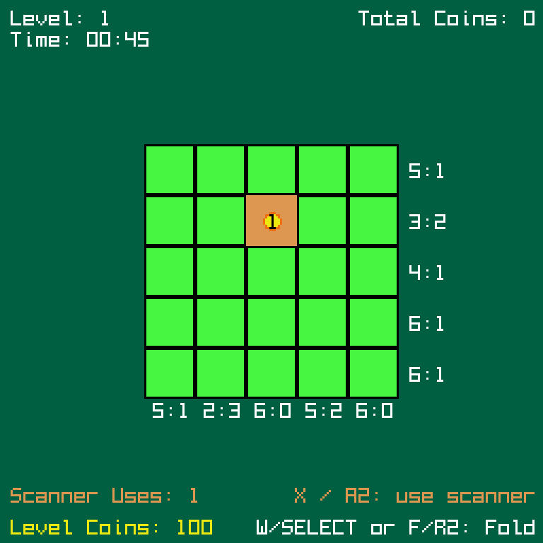
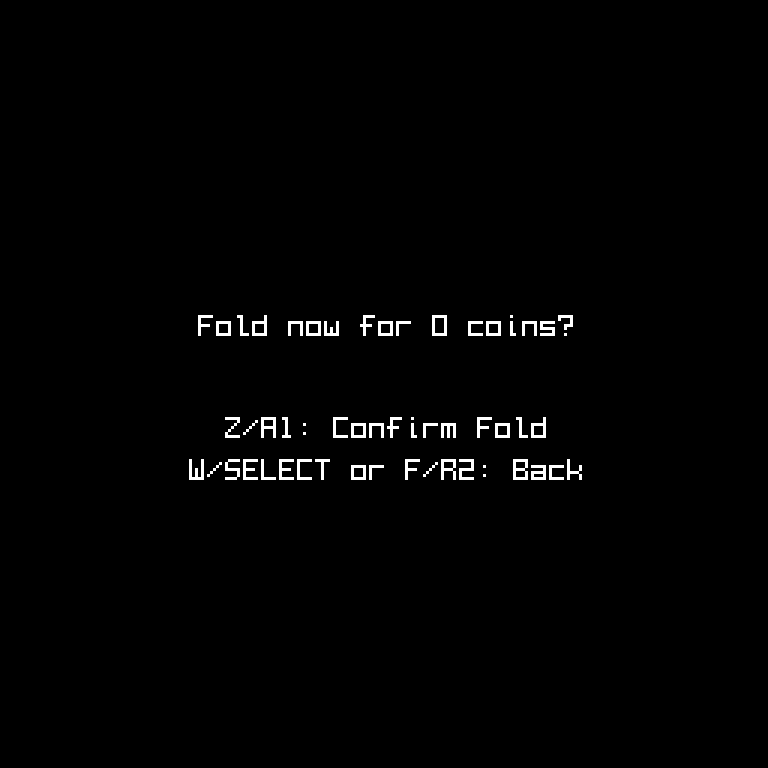
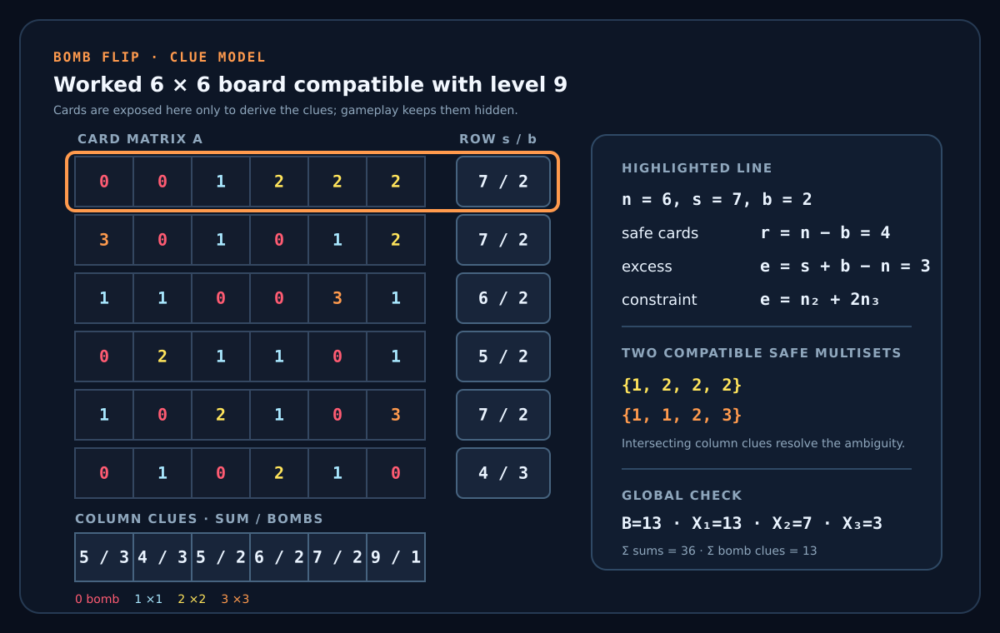

# Bomb Flip

Bomb Flip is a timed strategy-puzzle RIVES cartridge inspired by Voltorb Flip from Pokémon HeartGold and SoulSilver. Each hidden card contains a ×1, ×2 or ×3 coin, or a bomb; row and column clues show the value sum and bomb count.

## Inspiration and independent design

Bomb Flip deliberately starts from the mathematical core of Voltorb Flip: a hidden grid with values 0, 1, 2 and 3, two clues for every row and column, and a completion condition that requires revealing every ×2 and ×3 card while avoiding zero-value hazards. Bomb Flip level 1 also uses the same composition as one of Voltorb Flip's level-1 board types: 6 hazards, three ×2 cards and one ×3 card.

The implementation is not a reproduction of the original game. Bomb Flip introduces its own additive score and time economy, a countdown extended by safe cards, scanner previews, a fold-for-half stopping rule, twelve sequential levels and 6 × 6 boards from level 9 onward. Its later level compositions are custom. Voltorb Flip instead uses multiplicative coin payouts, a memo pad, eight 5 × 5 levels, several board configurations per level, generator constraints that reject overly easy boards, and history-dependent level changes.

The detailed [mathematics and design comparison](docs/mathematics.md) derives the shared clue equations, generalizes the classic dead-line rule to Bomb Flip's 6 × 6 boards, and documents the generator, probability, scoring and feature differences with sources.

Bomb Flip is an independent, unaffiliated RIVES cartridge. Pokémon, Pokémon HeartGold and SoulSilver, Voltorb Flip and related names belong to their respective rights holders.

## Original RIVES cartridge

- [Play the original Bomb Flip cartridge on RIVES](https://app.rives.io/cartridges/5932d82f5827)
- [Paolo's RIVES profile](https://app.rives.io/profile/0x2e092f91bc25ebd12b8b0e4df87d9d0424d6460c) — the profile lists the two original cartridges
- [Cartesi Ecosystem Recap #14 — Bomb Flip featured as Paolo's RIVES cartridge](https://cartesi.io/blog/ecosystem-recap-202410/)
- Original publication: 5 October 2024, under the RIVES profile **Paolo**

## About this repository

This repository contains a maintained, post-publication version of the Bomb Flip cartridge originally published on RIVES. The exact source snapshot corresponding to the original published cartridge is no longer retained; the current codebase includes subsequent fixes, cleanup, documentation and refactoring.

Only the maintained source and the assets required to build it are included here; working archives and extracted copies of the original cartridge are intentionally excluded.

The current maintained version is developed with assistance from OpenAI Codex.

## Development

Bomb Flip was developed in C against the RIV API (`riv.h`) through a Cursor-assisted workflow. Paolo De Marinis adapted the Voltorb Flip-inspired puzzle core into a timed RIVES cartridge and designed Bomb Flip's distinct timer, additive scoring, scanner, folding, extended progression and larger late-game boards. He directly wrote and modified parts of the code and handled integration, testing, debugging and refinement.

## Technical reading path

The documentation moves from the mathematical model to its implementation:

1. [Mathematics and design lineage](docs/mathematics.md) — inherited constraints, Bomb Flip-specific choices, derivations, worked examples and source attribution.
2. [Code overview](docs/code-overview.md) — state, frame flow, rules, rendering and RIVES integration.
3. [Validation](docs/validation.md) — reproducible checks and stated limits of the available regression evidence.

## Gameplay

Reveal every ×2 and ×3 card without selecting a bomb. Revealed coin cards add score and time. Scanner cards grant limited previews, while folding ends the run and keeps half of the current level's coins. The board grows from 5 × 5 to 6 × 6 across twelve levels.

The animation is a deterministic replay of the normal cartridge build: it starts a run, moves across the hidden board, opens and closes Fold, reveals a Scanner and uses its preview. No debug or cheat build is shown.

| Live board and Scanner | Fold decision |
|---|---|
|  |  |

| Action | Keyboard | RIVES gamepad |
|---|---|---|
| Start | Z or E | A1 or START |
| Move selection | Arrow keys | D-pad |
| Reveal card | Z | A1 |
| Use scanner | X | A2 |
| Open / close Fold | W or F | SELECT or R2 |
| Confirm Fold | Z | A1 |

Fold can be opened or closed with either W/SELECT or the mnemonic F/R2 shortcut. Inside the dialog, the ordinary action button Z/A1 confirms the run-ending decision. E/START is reserved for starting the run and has no Fold-dialog role.

## Technical overview

`main()` configures the RIVES console and dispatches the title, transition, active run and ending. `GameState` stores the board, score, timer, scanner data and one explicit gameplay phase; separate title and audio structures own their respective state. Board mathematics, rules, rendering, title animation and audio are isolated in small C modules. Input is read from `riv->keys`, visuals use RIVES drawing primitives, and `riv_snprintf()` writes the current outcard.

The implementation is procedural C, not object-oriented code. See [the code overview](docs/code-overview.md) for the full frame flow, data structures, interactions and RIVES calls. The [mathematics and design comparison](docs/mathematics.md) formalizes the board matrix, clue constraints, level composition and fold decision, and compares them with the source of inspiration.

The exposed board above is a level-9-compatible mathematical example, not a gameplay reveal: it shows how every row and column produces a value-sum/bomb-count pair. The full derivation and level progression are in the [mathematics document](docs/mathematics.md).

## Code structure

- `src/bombflip.c` — application entry point and top-level RIVES screen dispatch.
- `src/state.h` — shared constants and explicit application/game state types.
- `src/board.c` — level table, fixed-count generator, clues and board predicates.
- `src/game.c` — input, score, timer, scanner, fold and outcome rules.
- `src/render.c` — board, interface, dialogs and gameplay animations.
- `src/title.c` — title, transition and easter-egg sequence.
- `src/audio.c` — background sequencer ownership and sound effects.
- `src/riv.h` — preserved RIVES API header used by the source and host checks.
- `src/seqt.h` — small sequenced-audio helper used by the background track.
- `src/songs/` — RIVES music asset.
- `src/info.json` and `src/cover.png` — cartridge metadata and cover.
- `docs/` — technical architecture and validation notes.

## Debug mode

`DEBUG_MODE` and `CHEATS_ENABLED` default independently to `0` in `src/state.h`. `DEBUG_MODE=1` enables diagnostic logging without altering the controls. `CHEATS_ENABLED=1` separately compiles and tracks the R1 level-completion helper. The two flags can be enabled alone or together; scanner, timer and normal gameplay are unchanged.

## Technical documentation

- [Code overview](docs/code-overview.md)
- [Mathematics and design comparison](docs/mathematics.md)
- [Validation](docs/validation.md)

## Related RIVES cartridge

- [Slither Slide source repository](https://github.com/paolo-de-marinis/slither-slide)
- [Play the original Slither Slide cartridge on RIVES](https://app.rives.io/cartridges/7654435bf067)

## Prerequisites: RIVEMU and the RIV SDK

This cartridge uses the official [RIV framework and RIVEMU repository](https://github.com/rives-io/riv). RIVEMU is sufficient to run an already-built cartridge; compiling the C sources also requires the RIV SDK.

For complete and platform-specific instructions, see the official RIVES guides:

- [Installing RIVEMU](https://rives.io/docs/riv/getting-started/)
- [Installing the SDK and developing cartridges](https://rives.io/docs/riv/developing-cartridges/)

The following Linux x86_64 setup matches the default paths used by this repository's Makefile:

~~~sh
mkdir -p "$HOME/.riv"

wget -O "$HOME/.riv/rivemu" \
  https://github.com/rives-io/riv/releases/latest/download/rivemu-linux-amd64
chmod +x "$HOME/.riv/rivemu"

wget -O "$HOME/.riv/rivos-sdk.ext2" \
  https://github.com/rives-io/riv/releases/latest/download/rivos-sdk.ext2
~~~

Verify both components:

~~~sh
"$HOME/.riv/rivemu" -version

RIVEMU_SDK="$HOME/.riv/rivos-sdk.ext2" \
  "$HOME/.riv/rivemu" -quiet -no-window -sdk \
  -exec /usr/lib/libriv.so version
~~~

The maintained refactor is verified with RIVEMU and `libriv` 0.3.0, including a 96 MB runtime smoke test and the official web emulator, as recorded in [Validation](docs/validation.md). For another operating system or architecture, download the matching RIVEMU binary from the [official releases](https://github.com/rives-io/riv/releases) and pass its path to `make`.

## Building and running

By default, the Makefile reads RIVEMU and the SDK from `~/.riv`. To use different locations, override `RIVEMU` and `RIVEMU_SDK`:

~~~sh
make -C src \
  RIVEMU=/path/to/rivemu \
  RIVEMU_SDK=/path/to/rivos-sdk.ext2 \
  clean all
~~~

With the default installation above:

~~~sh
make -C src clean all
make -C src run
~~~

The default `all` target follows the [official optimized-cartridge workflow](https://rives.io/docs/riv/developing-cartridges/#compiling-optimized-cartridges): every source module is compiled with `riv-opt-flags -Ospeed`, then `riv-strip` removes non-runtime ELF data from the linked executable before `riv-mksqfs` packages the cartridge.

Checks:

~~~sh
make -C src strict test
make -C src smoke
~~~

`strict` performs a warning-free C11 analysis, `test` checks mathematical invariants and outcome rules on the host, and `smoke` runs the packaged RIVES cartridge headlessly for 180 frames.

## Repository history

This repository begins from the maintained source available after the original 2024 publication, not from an exact archival snapshot of the published cartridge. The published RIVES cartridge remains available through the link above, while local working archives and cleanup history are intentionally not part of this repository. The later cleanup does not establish historical authorship of individual parts of the original cartridge.

## License

Except for the third-party material listed in [`THIRD_PARTY_NOTICES.md`](THIRD_PARTY_NOTICES.md), the source code, documentation and original assets in this repository are Copyright © 2024–2026 Paolo De Marinis and licensed under the [GNU General Public License v3.0 or later](LICENSE) (`GPL-3.0-or-later`).

As copyright holder, Paolo De Marinis also offers under `GPL-3.0-or-later` all prior versions of his original material recorded in this repository's Git history. This present grant does not relicense third-party material or contributions owned by others.
