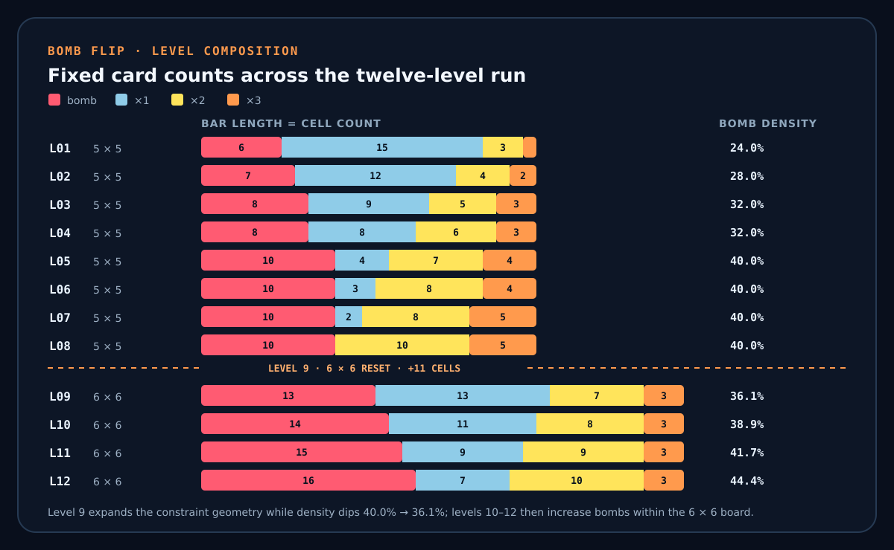

# Mathematics and design lineage: Bomb Flip and Voltorb Flip

## Scope and attribution

Bomb Flip is inspired by Voltorb Flip, the minigame included in the non-Japanese releases of Pokémon HeartGold and SoulSilver. The inspiration is substantive: both games use hidden 0/1/2/3 values, show a value sum and hazard count for every row and column, and complete a board when every ×2 and ×3 card has been revealed.

This document separates that shared foundation from Bomb Flip's own mathematical and gameplay choices. The maintained Bomb Flip RIVES cartridge code is the authority for Bomb Flip behavior. For the original game, exact implementation details are checked against the [pret/pokeheartgold community decompilation](https://github.com/pret/pokeheartgold/tree/master/src/voltorb_flip), which is a reconstruction of the game code rather than official Nintendo documentation.

The comparison does not claim that the shared clue system, card alphabet or ×2/×3 completion rule originated in Bomb Flip. It documents how Paolo De Marinis adapted that foundation into a timed RIVES cartridge with different scoring, risk, generation and progression.

## 1. Lineage at a glance

| Category | Elements |
|---|---|
| Clearly inherited from Voltorb Flip | hidden 0/1/2/3 grid; row and column value sums; row and column hazard counts; reveal all ×2 and ×3 cards; avoid zero-value hazards |
| Direct numerical correspondence | Bomb Flip level 1 uses 6 bombs, three ×2 cards and one ×3 card, exactly one of Voltorb Flip's level-1 compositions |
| Bomb Flip-specific design | additive score; countdown and time rewards; scanner previews; fold for half of current-level coins; twelve sequential levels; 6 × 6 late-game boards; one custom composition per level; no board-rejection filter |
| Present in Voltorb Flip but not Bomb Flip | multiplicative payout; memo marks; eight fixed 5 × 5 levels; several board types per level; rejection of boards with too many risk-free multipliers; history- and cards-flipped-dependent level changes |

The original rules and its five composition choices per level are summarized by [Bulbapedia](https://bulbapedia.bulbagarden.net/wiki/Voltorb_Flip). The generator details in the last row are visible in the [reconstructed game-state source](https://github.com/pret/pokeheartgold/blob/90e85d4e027f5e04800e7e015b3207094061402c/src/voltorb_flip/voltorb_flip_game.c).

## 2. Shared board model

For a square board of side $n$, let

```math
A=(a_{ij})\in\{0,1,2,3\}^{n\times n},
```

where

- $a_{ij}=0$ is a hazard: a Voltorb in the original game and a bomb in Bomb Flip;
- $a_{ij}=1$ is a ×1 card;
- $a_{ij}=2$ is a ×2 card;
- $a_{ij}=3$ is a ×3 card.

Voltorb Flip always uses $n=5$. Bomb Flip uses $n=5$ for levels 1–8 and $n=6$ for levels 9–12.

Let $B,X_1,X_2,X_3$ be the numbers of the four card types and let $N=n^2$. Every board satisfies

```math
B+X_1+X_2+X_3=N,
```

so

```math
X_1=N-B-X_2-X_3.
```

Bomb Flip's `board_clear()` initializes every active cell to 1 and the internal placement routine replaces distinct cells with the configured bombs, ×2 cards and ×3 cards.

## 3. Shared clue equations

For row $i$, both games display the value sum

```math
s_i=\sum_{j=1}^{n}a_{ij}
```

and the hazard count

```math
b_i=\sum_{j=1}^{n}I(a_{ij}=0).
```

For column $j$, they display

```math
c_j=\sum_{i=1}^{n}a_{ij}
```

and

```math
d_j=\sum_{i=1}^{n}I(a_{ij}=0).
```

Here $I(P)$ is 1 when condition $P$ is true and 0 otherwise.

In Bomb Flip these four arrays are calculated directly from the grid by `board_calculate_clues()`. In the reconstructed Voltorb Flip source, the corresponding point sums and Voltorb counts are also derived from the generated 5 × 5 board. The clue geometry is therefore the closest mathematical link between the two games.


The diagram deliberately exposes every card in one level-9-compatible board so the equations can be checked visually. Each clue is written as `sum / bombs`; the highlighted first row is the worked line derived in section 5. In the actual game these values remain hidden.

## 4. Global consistency invariants

Row sums and column sums count the same values:

```math
\sum_{i=1}^{n}s_i
=
\sum_{j=1}^{n}c_j
=
X_1+2X_2+3X_3.
```

Substituting the expression for $X_1$ gives

```math
\sum_i s_i=\sum_j c_j=N-B+X_2+2X_3.
```

Hazard counts obey

```math
\sum_i b_i=\sum_j d_j=B.
```

These identities are shared by both games. They are useful for validating a generator and for detecting an inconsistent transcription of a puzzle.

### Worked global check: Bomb Flip level 1

Level 1 has $N=25$, $B=6$, $X_2=3$ and $X_3=1$, hence

```math
X_1=25-6-3-1=15.
```

Before considering the positions of the cards, every valid generated board must satisfy

```math
\sum_i s_i=\sum_j c_j
=15+2\cdot3+3\cdot1
=24
```

and

```math
\sum_i b_i=\sum_j d_j=6.
```

These are inexpensive whole-board checks: they validate the clue computation independently of any particular arrangement.

## 5. What one line implies

Consider a row or column of length $n$ with $b$ hazards and displayed sum $s$. Let $n_1,n_2,n_3$ be the counts of ×1, ×2 and ×3 cards in the line. The number of safe cards is

```math
r=n-b=n_1+n_2+n_3.
```

If every safe card were ×1, its sum would be $r$. Define the excess

```math
e=s-r=s+b-n.
```

A ×2 contributes one unit above the ×1 baseline, while a ×3 contributes two. Therefore

```math
e=n_2+2n_3.
```

The possible compositions are constrained by

```math
\max(0,e-r)\leq n_3\leq\left\lfloor\frac{e}{2}\right\rfloor,
```

followed by

```math
n_2=e-2n_3,
\qquad
n_1=r-n_2-n_3.
```

This compact derivation explains many familiar Voltorb Flip deduction rules without listing them as isolated tricks. The [Cave of Dragonflies strategy guide](https://www.dragonflycave.com/johto/voltorb-flip/) gives worked line-composition examples; the equations above generalize the same reasoning to either board size used by Bomb Flip.

### Worked 6 × 6 line

The highlighted first row in the clue-model diagram has length $n=6$, two bombs and displayed sum $s=7$. Then

```math
r=6-2=4,
\qquad
e=7-4=3.
```

The bound permits $n_3=0$ or $n_3=1$:

| $n_3$ | $n_2$ | $n_1$ | Safe multiset | Complete line |
|---:|---:|---:|---|---|
| 0 | 3 | 1 | $\{1,2,2,2\}$ | $\{0,0,1,2,2,2\}$ |
| 1 | 1 | 2 | $\{1,1,2,3\}$ | $\{0,0,1,1,2,3\}$ |

The clues determine the two possible line compositions but do not distinguish between them. Information from intersecting columns or revealed cells is required to remove the ambiguity. This is precisely why treating rows and columns as independent probability problems is generally incorrect.

## 6. The dead-line rule, generalized to 6 × 6

A line is “dead” when none of its unrevealed cells can contain a required ×2 or ×3 card. Suppose $q_2$ ×2 cards and $q_3$ ×3 cards have already been revealed in that line. The remaining excess is

```math
e_{\mathrm{rem}}=s+b-n-q_2-2q_3.
```

The line is dead exactly when

```math
e_{\mathrm{rem}}=0.
```

For the original 5 × 5 game this becomes

```math
s+b-5=q_2+2q_3.
```

That is the classic formula documented in the [GameFAQs Voltorb Flip guide](https://gamefaqs.gamespot.com/ds/960100-pokemon-soulsilver-version/faqs/59308) and in the [Bulbapedia strategy section](https://bulbapedia.bulbagarden.net/wiki/Voltorb_Flip#Dead_row/column_formula).

For Bomb Flip levels 1–8 the same formula applies unchanged. For levels 9–12, the board is 6 × 6, so the correct version is

```math
s+b-6=q_2+2q_3.
```

The familiar “total five” shortcut is the special case $n=5$ and $q_2=q_3=0$: if $s+b=5$, the line initially contains only hazards and ×1 cards. On a 6 × 6 Bomb Flip board, the corresponding shortcut is $s+b=6$.

This is a mathematical extension made necessary by Bomb Flip's larger late-game board, not a different clue system.

## 7. Completion as a subset condition

Let $R$ be the set of revealed cells. Both games complete a board when

```math
\{(i,j):a_{ij}\in\{2,3\}\}\subseteq R.
```

Revealing every ×1 card is unnecessary. This is why dead lines can be ignored safely: once a line's remaining excess is zero, nothing required for completion remains there.

In Bomb Flip this rule is implemented by `board_all_high_cards_flipped()`. In the reconstructed original, multiplier cards are counted and the round is won when the current payout reaches the board's maximum product, which occurs after every ×2 and ×3 has been flipped.

## 8. Generator mathematics: where the distributions diverge

### Bomb Flip

Each Bomb Flip level has one fixed tuple $(B,X_2,X_3)$. Positions are repeatedly sampled until all configured non-×1 cards occupy distinct cells. Assuming `riv_rand_uint()` is uniform on the requested coordinate range, this is sampling without replacement. A board is generated once, when the player starts the run; application initialization does not generate a hidden board and discard it.

The number of categorical layouts for one configured level is

```math
M=\frac{N!}{B!\,X_1!\,X_2!\,X_3!}.
```

Before clues or reveals are observed, a position has marginals

```math
P(a_{ij}=0)=\frac{B}{N},
\qquad
P(a_{ij}=k)=\frac{X_k}{N}
\quad(k=1,2,3).
```

Bomb Flip does not reject a board because it is easy, and it has no solver or probability engine. Scanner locations are sampled only after the board is complete and therefore do not alter this board distribution. Their ordinary selection uses the same random rejection method; after one hundred unsuccessful attempts, a row-major safe-cell fallback makes assignment total rather than probabilistically fallible.

### Voltorb Flip

The reconstructed original uses 80 board-configuration entries: ten entries associated with each of eight levels. Its level distribution nominally gives each of those ten entries a 10% selection interval. The ten entries represent five composition tuples listed twice; depending on the level, the paired entries can carry different limits on how many ×2/×3 cards may be exposed in zero-Voltorb rows or columns.

After a board type is selected, the code randomly places Voltorbs, ×2 cards and ×3 cards, then retries when the number of risk-free multipliers reaches configured line or board limits. It attempts this rejection process up to 1,000 times. See `sBoardIdDistribution`, `sBoardConfigs`, `VoltorbFlipGameState_RetryBoardGen()` and `VoltorbFlipGameState_GenerateBoard()` in the [community decompilation](https://github.com/pret/pokeheartgold/blob/90e85d4e027f5e04800e7e015b3207094061402c/src/voltorb_flip/voltorb_flip_game.c).

Consequently, “all boards satisfying the visible clues are equally likely” is a reasonable model for Bomb Flip's fixed-count generator, but not for Voltorb Flip when the hidden board type and its rejection filter are unknown.

## 9. Conditional probability and solvers

Let $H$ represent all visible row/column clues and revealed cells. For Bomb Flip, let $N_H$ be the number of fixed-count layouts compatible with $H$, and let $N_{ij,v}$ be the number of those layouts in which $a_{ij}=v$. Under the uniform-placement assumption,

```math
P(a_{ij}=v\mid H)=\frac{N_{ij,v}}{N_H}.
```

Rows and columns are not independent events: a cell assignment simultaneously affects one row and one column. Marcus Pasell's [algorithmic analysis of Voltorb Flip](https://understandable.dev/deep-dives/voltorb-flip/) develops this dependence and enumerates compatible solutions by backtracking.

For the original generator, a type variable $T$ must also be considered:

```math
P(a_{ij}=v\mid H)
=
\sum_t
P(a_{ij}=v\mid H,T=t)
P(T=t\mid H).
```

The posterior weight of a type changes with the clues and with the number of accepted boards that type can generate. The independent [Voltorb Flip solver explanation](https://gimmytomas.github.io/voltorb-flip/algorithm.html) presents a Bayesian implementation that accounts for those board types and legality filters. It is a solver analysis, not part of Bomb Flip and not an authority for Bomb Flip behavior.

## 10. Scoring: exponential versus additive

Let $q_1,q_2,q_3$ be the numbers of revealed safe cards of each value.

### Voltorb Flip payout

After at least one safe card has been revealed, the original current-round payout is the product

```math
C_{\mathrm{VF}}=2^{q_2}3^{q_3}.
```

×1 cards do not change it. Before any card is revealed, the interface represents the payout as zero. The reconstructed code multiplies the current-round payout by each safe card value and caps that payout at 50,000. A board with $X_2$ twos and $X_3$ threes therefore has maximum payout

```math
C_{\mathrm{VF,max}}=\min(50000,2^{X_2}3^{X_3}).
```

### Bomb Flip score and time

Bomb Flip awards a linear card score within the current level:

```math
C_{\mathrm{cards}}=100(q_1+2q_2+3q_3).
```

At level $\ell$, the timer starts at

```math
t_0=45+5(\ell-1)
```

seconds. Revealing a safe value $v$ adds $3v$ seconds, capped at 150 seconds. Completing the level banks the card score and adds the truncated time bonus

```math
C_{\mathrm{time}}=\left\lfloor 10t\right\rfloor,
```

where $t$ is the remaining time sampled after the remaining-card animation. The countdown is frozen from the reveal of the last required card through that animation and the cleared-level panel.

Scanner previews and the fold confirmation are deliberately modal. If $t$ is the time before either interaction and no card is revealed while it is open, then

```math
t'=t.
```

The same frames suspend sequenced-music polling and the periodic outcard refresh from the main loop. Scanner use and fold cancellation leave the outcard unchanged; confirming a fold writes the terminal result through `game_finish()`. This makes consultation time free: using an information reward or evaluating the stopping choice does not consume the countdown resource.

The scoring difference is structural. Voltorb Flip makes successive ×2/×3 reveals exponentially more valuable; Bomb Flip gives each card an additive value and couples reward to speed.

## 11. Stopping and failure are not equivalent

Voltorb Flip's Quit action ends the current round and awards the full current payout. The next level is then determined from round outcome, previous level and number of cards flipped. Revealing a Voltorb sets the current payout to zero. These behaviors are visible in the [reconstructed application flow](https://github.com/pret/pokeheartgold/blob/90e85d4e027f5e04800e7e015b3207094061402c/src/voltorb_flip/voltorb_flip.c) and summarized in the [rules overview](https://bulbapedia.bulbagarden.net/wiki/Voltorb_Flip).

Bomb Flip's Fold is a different optimal-stopping problem. It terminates the entire run and banks

```math
C_{\mathrm{fold}}=\left\lfloor\frac{C_{\mathrm{cards}}}{2}\right\rfloor
```

from the current level, in addition to coins banked from earlier levels.

A bomb also ends the Bomb Flip run. The current implementation does not add the current level's provisional `levelCoins` to `totalCoins`, but it does not erase coins already banked from earlier completed levels. Timeout is more severe: it explicitly resets both totals to zero.

Therefore Bomb Flip's Fold should not be described as merely renaming Voltorb Flip's Quit. The retained fraction, scope of termination and surrounding score model are all different.

### Fold as a finite-state decision

The relationship between deduction and risk can be written schematically as a finite-state decision problem. Let the reduced state be

```math
z=(\ell,H,t,B,S,u,r),
```

where $\ell$ is the level, $H$ is the visible information, $t$ is the remaining time, $B$ is the previously banked score, $S$ is the provisional level score, $u$ is the number of scanner uses and $r$ collects scanner-unlock and phase information. A production solver could refine $r$ into explicit state variables. Folding has the deterministic value

```math
F(z)=B+\left\lfloor\frac{S}{2}\right\rfloor.
```

For an unrevealed cell $x$, let $p_v(x\mid H)$ be the probability that it contains $v$. If $T_v(z,x)$ denotes the exact game transition after revealing value $v$—including score, capped time reward, level completion and the timer state—then the reveal action has value

```math
Q_{\mathrm{reveal}}(z,x)
=
p_0(x\mid H)B
+
\sum_{v=1}^{3}p_v(x\mid H)V\!\left(T_v(z,x)\right).
```

The bomb term returns only the previously banked total. Timeout is a separate terminal state with value zero. A scanner action consumes one use and changes the information state without persistently revealing the card. Because the preview is modal, its transition has $t'=t$; its expected value is obtained by conditioning the next decision on the previewed value.

Conceptually, an optimal policy satisfies

```math
V(z)=\max\!\left\{
F(z),
\max_x Q_{\mathrm{reveal}}(z,x),
\max_x Q_{\mathrm{scan}}(z,x)
\right\}.
```

Bomb Flip does not calculate this function in code. The formulation documents the mathematical consequence of its design: clues determine posterior risk, while the additive score, asymmetric bomb/timeout losses, timer and limited information actions determine whether that risk is worth taking.

### Design parameters and level transition

For a configured level, the sum of all safe values is

```math
S_{mathrm{safe}}=N-B+X_2+2X_3.
```

The smallest card score compatible with completion occurs when the player reveals no optional ×1 card:

```math
C_{mathrm{required}}=100(2X_2+3X_3).
```

Revealing every safe card instead gives

```math
C_{mathrm{safe,max}}=100S_{mathrm{safe}}.
```

The interval between these values is exactly $100X_1$. The level tuple therefore controls not only hazard density, but also how much optional ×1 exploration can add before the time bonus.

The transition from level 8 to level 9 is intentionally not monotone in every statistic. The board grows from 25 to 36 cells and bombs increase from 10 to 13, while bomb density temporarily falls from 40% to about 36.1%. Required high cards decrease from 15 to 10 and ×1 cards reappear, from 0 to 13. Level 9 introduces the 6 × 6 constraint geometry as a structural reset; levels 10–12 then increase bomb density and ×2 count within that larger geometry.

## 12. Level composition

Bomb Flip's implemented configurations are:



Bar length encodes the number of cells, so the level-9 expansion from 25 to 36 cells is visible separately from the color proportions. It is a structural reset: bomb density briefly falls before climbing to its maximum at level 12.

| Level | Grid | Cells | ×2 | ×3 | Bombs | ×1 | Bomb density | Relation to same Voltorb Flip level |
|---:|:---:|---:|---:|---:|---:|---:|---:|---|
| 1 | 5 × 5 | 25 | 3 | 1 | 6 | 15 | 24.0% | Exact match to one original composition |
| 2 | 5 × 5 | 25 | 4 | 2 | 7 | 12 | 28.0% | Custom tuple |
| 3 | 5 × 5 | 25 | 5 | 3 | 8 | 9 | 32.0% | Custom tuple |
| 4 | 5 × 5 | 25 | 6 | 3 | 8 | 8 | 32.0% | Custom tuple |
| 5 | 5 × 5 | 25 | 7 | 4 | 10 | 4 | 40.0% | Custom tuple |
| 6 | 5 × 5 | 25 | 8 | 4 | 10 | 3 | 40.0% | Custom tuple |
| 7 | 5 × 5 | 25 | 8 | 5 | 10 | 2 | 40.0% | Custom tuple |
| 8 | 5 × 5 | 25 | 10 | 5 | 10 | 0 | 40.0% | Custom tuple |
| 9 | 6 × 6 | 36 | 7 | 3 | 13 | 13 | 36.1% | No original 6 × 6 analogue |
| 10 | 6 × 6 | 36 | 8 | 3 | 14 | 11 | 38.9% | No original 6 × 6 analogue |
| 11 | 6 × 6 | 36 | 9 | 3 | 15 | 9 | 41.7% | No original 6 × 6 analogue |
| 12 | 6 × 6 | 36 | 10 | 3 | 16 | 7 | 44.4% | No original 6 × 6 analogue |

For levels 2–8, “custom tuple” means that the Bomb Flip tuple is not one of the five compositions listed for the same-numbered Voltorb Flip level. Voltorb Flip's complete composition and payout table is available in the [Bulbapedia mechanics section](https://bulbapedia.bulbagarden.net/wiki/Voltorb_Flip#Gameplay) and the reconstructed `sBoardConfigs` table.

The level-1 match is important attribution evidence. The later divergence is equally important: Bomb Flip does not copy the original level table as a whole.

## 13. Functional comparison

| Feature | Voltorb Flip in HGSS | Bomb Flip | Mathematical or gameplay consequence |
|---|---|---|---|
| Board | Always 5 × 5 | 5 × 5, then 6 × 6 | Dead-line baseline changes from 5 to 6 |
| Levels | 8 | 12 | Bomb Flip has a longer single-run curve |
| Clues | line sum + Voltorb count | line sum + bomb count | Same constraint system |
| Goal | reveal every ×2 and ×3 | reveal every ×2 and ×3 | Same subset completion rule |
| Reward | product of revealed values | additive card score + time bonus | Exponential versus linear utility |
| Time | no countdown | countdown; safe cards add time | Speed is a state variable only in Bomb Flip |
| Hazard | loses current-round payout | ends run; current-level score remains unbanked | Different scope of loss |
| Voluntary stop | Quit keeps full current payout | Fold keeps half current-level score and ends run | Different stopping value |
| Deduction aid | memo marks for 0/1/2/3 | temporary scanner previews | Annotation versus paid information |
| Scanner allocation | none | one safe scanner tile on levels 1–8; two independent tiles on levels 9–12 | Revealing either grants uses equal to its card value; previews do not consume time |
| Board types | ten configuration entries per level, with five compositions | one composition per level | Original probability model is a type mixture |
| Ease filter | rejects boards with too many free multipliers | none | Bomb Flip samples the full fixed-count layout space |
| Progression | depends on win/loss/quit history and cards flipped; leaving resets to level 1 | sequential level 1 through 12 in one run | Original can advance or fall; Bomb Flip does not demote |
| Timeout | none | timeout zeros the run total | New catastrophic risk in Bomb Flip |

## 14. Constraint-system view

For analysis, introduce binary variables

```math
x_{ij}^{(v)}\in\{0,1\},
\qquad
v\in\{0,1,2,3\},
```

where $x_{ij}^{(v)}=1$ exactly when cell $(i,j)$ contains $v$. Each cell obeys

```math
\sum_{v=0}^{3}x_{ij}^{(v)}=1.
```

For row $i$,

```math
\sum_j\sum_{v=0}^{3}v\,x_{ij}^{(v)}=s_i
```

and

```math
\sum_jx_{ij}^{(0)}=b_i.
```

Columns have analogous equations, and the configured card counts add global constraints.

This formulation explains why deductions at row/column intersections and compatible-board enumeration work in either game. Bomb Flip's shipped C code does not implement this solver; it stores the integer matrix directly and computes clues with loops.

## 15. Design conclusions

The comparison supports four precise claims:

1. Bomb Flip is genuinely inspired by Voltorb Flip, not merely adjacent to it. The clue system, card values, completion rule and first-level composition are concrete points of lineage.
2. Bomb Flip changes the reward model from a product to a sum and introduces time, turning a pure reveal-risk puzzle into a reveal-risk-speed problem.
3. Bomb Flip's generator is mathematically simpler: one fixed composition per level with no ease-rejection filter. Voltorb Flip's hidden board type and rejection rules matter when calculating exact probabilities.
4. The 6 × 6 boards are a real extension. They preserve the same equations but change every line-length constant, most visibly in the dead-line rule.

These are the Bomb Flip-specific mathematical choices that should be presented as Paolo's adaptations. The shared Voltorb Flip foundation should remain explicitly credited.

## 16. Relevant Bomb Flip code

- `grid` in `GameState` — board matrix.
- `LEVEL_CONFIGS` in `board.c` — the twelve fixed compositions.
- `board_grid_size()` — 5 × 5 to 6 × 6 transition.
- `board_clear()` and the internal placement routine — fixed-count generator.
- `board_calculate_clues()` — line sums and bomb counts.
- `board_all_high_cards_flipped()` — shared ×2/×3 completion condition.
- `game_reveal_selected()` — additive coins, time gains and scanner activation.
- `board_assign_scanner_tiles()` and the modal scanner routine — information mechanic.
- fold input and `game_finish()` in `game.c` — stopping and loss outcomes.

## 17. Sources and how they were used

- [Original Bomb Flip cartridge on RIVES](https://app.rives.io/cartridges/5932d82f5827) — published cartridge and provenance record.
- [Bomb Flip board implementation](../src/board.c) and [game rules](../src/game.c) — authoritative sources for Bomb Flip's level data, generator, clues, scoring, timer, scanner, fold and endings.
- [pret/pokeheartgold: Voltorb Flip game-state reconstruction](https://github.com/pret/pokeheartgold/blob/90e85d4e027f5e04800e7e015b3207094061402c/src/voltorb_flip/voltorb_flip_game.c) — board configurations, random selection, rejection rules, clues, payout multiplication, completion counters and level calculation. This is a community decompilation, not official documentation.
- [pret/pokeheartgold: Voltorb Flip application reconstruction](https://github.com/pret/pokeheartgold/blob/90e85d4e027f5e04800e7e015b3207094061402c/src/voltorb_flip/voltorb_flip.c) — Quit flow, payout transfer, memo interface and round outcomes.
- [Bulbapedia: Voltorb Flip](https://bulbapedia.bulbagarden.net/wiki/Voltorb_Flip) — accessible overview of gameplay, progression, composition table, memo and dead-line formulas.
- [Marcus Pasell: “How to solve Voltorb Flip using an algorithm”](https://understandable.dev/deep-dives/voltorb-flip/) — dependence of row and column events, compatible-solution enumeration and per-cell probabilities.
- [The Cave of Dragonflies: Voltorb Flip Guide](https://www.dragonflycave.com/johto/voltorb-flip/) — worked deduction rules and reduced-line examples.
- [GameFAQs: Voltorb Flip Guide](https://gamefaqs.gamespot.com/ds/960100-pokemon-soulsilver-version/faqs/59308) — the classic 5-cell dead-line equation and strategy explanation.
- [Gimmy Tomas: How the Solver Works](https://gimmytomas.github.io/voltorb-flip/algorithm.html) — external Bayesian analysis of the original board-type mixture and rejection constraints; cited as solver methodology, not as Bomb Flip implementation evidence.
